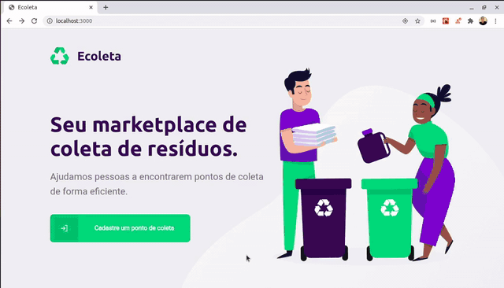
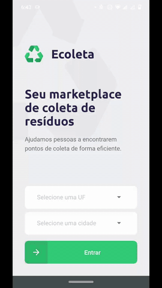

<h1 id="title" align="center">Ecoleta</h1>

<div align="center">
  <a href="#description">Description</a> |
  <a href="#preview">Preview</a> |
  <a href="#technologies">Technologies</a> |
  <a href="#how-to-use">How to use</a> |
  <a href="#info">Additional information</a> |
  <a href="#license">License</a>
</div>

<h2 id="description">📑️ Description</h2>
<p>
  Ecoleta is a connection platform between establishments that collect items for recycling and people who have these items and want to recycle them. In the web version, the system user can register his establishment as a collect point informing which of the items listed in the system he collects for recycling. In the mobile version, the user who wants to recycle can search for collection points by state and city, find those who collect the items they want to recycle and, in short, contact the establishment through email or whatsapp.
</p>

<h2 id="preview">📽️ Preview</h2>

<h3 align="center">WEB</h3>

<div align="center">
  
</div>

<h3 align="center">MOBILE</h3>

<div align="center">
  
</div>

<h2 id="technologies">💻️ Technologies</h2>
<ul>
  <li>🌐️ Web:</li>
  <div>&nbsp;&nbsp;&nbsp;&nbsp;&nbsp;&nbsp;- Frontend: React</li></div>
  <div>&nbsp;&nbsp;&nbsp;&nbsp;&nbsp;&nbsp;- Backend: NodeJs</li></div>
  <li>📱️ Mobile app: React Native</li>
  <li>💾️ Database: Knex e Sqlite3</li>
  <li>⌨️ Programming language: Typescript</li>
</ul>

<h2 id="how-to-use">👨🏽‍💻️ How to use</h2>
<h3>1. Download the project:</h3>

```
  # if you use HTTPS
  git clone https://github.com/MisaelAugusto/next-level-week-1.0.git

  # if you use SSH
  git clone git@github.com:MisaelAugusto/next-level-week-1.0.git
```

<h3>2. Install dependencies:</h3>

```
  # go to project directory
  cd next-level-week-1.0

  # go to each project folder and install dependencies
  cd server
  yarn install

  cd ../web
  yarn install

  cd ../mobile
  yarn install
```

<h3>3. Set database up:</h3>

```
  # go to backend directory
  cd server

  # run migrations
  yarn knex migrate:latest

  # run seeds
  yarn knex seed:run

  # open the 'ItemsController.ts' and 'PointsController.ts' files and change
  # the values of the attribute 'image_url' according to your network ip
```

<h3>4. Run the backend:</h3>

```
  # go to backend directory
  cd server

  # start backend
  yarn start

  # keep backend running in a different terminal tab
```

<h3>5. Run the project:</h3>

<h4>5.1. Web</h4>

```
  # go to frontend directory
  cd web

  # start frontend
  yarn start

  # access http://localhost:3000 in your browser
```

<h4>5.2. Mobile</h4>

<h5>Note: To test the mobile app, you need to have the expo installed globally on your machine and the expo app on your mobile device.</h5>

```
  # go to mobile directory
  cd mobile

  # open the 'api.ts' file inside services folder and change
  # the attribute 'baseURL' according to your network ip

  # start mobile app
  yarn start

  # Use the expo app to read the QRcode
```

<h2 id="info">📌️ Additional Information</h2>
<h3 id="status">&nbsp;&nbsp;&nbsp;&nbsp;&nbsp;&nbsp;&nbsp;&nbsp;🔎️ Project Status</h3>
<p>
&nbsp;&nbsp;&nbsp;&nbsp;&nbsp;&nbsp;&nbsp;&nbsp;&nbsp;&nbsp;&nbsp;&nbsp;&nbsp;&nbsp;&nbsp;&nbsp;This project is finished. ✔️</p>

<h3 id="contributing">&nbsp;&nbsp;&nbsp;&nbsp;&nbsp;&nbsp;&nbsp;&nbsp;📊️ Contributing</h3>
<p>
&nbsp;&nbsp;&nbsp;&nbsp;&nbsp;&nbsp;&nbsp;&nbsp;&nbsp;&nbsp;&nbsp;&nbsp;&nbsp;&nbsp;&nbsp;&nbsp;
To contribute to the project in any way, it is necessary to fork the repository and follow the instructions in the section above, make your changes and / or updates and submit a pull request. I am open to all suggestions!</p>

<h3 id="feedback-support">&nbsp;&nbsp;&nbsp;&nbsp;&nbsp;&nbsp;&nbsp;&nbsp;💬️ Feedback and Support</h3>
<p>
&nbsp;&nbsp;&nbsp;&nbsp;&nbsp;&nbsp;&nbsp;&nbsp;&nbsp;&nbsp;&nbsp;&nbsp;&nbsp;&nbsp;&nbsp;&nbsp;If you have any questions about the project, how to contribute or want to send me some feedback, feel free to contact me through my e-mail adress clicking <a href="https://mail.google.com/mail/u/0/?view=cm&fs=1&to=misael.costa@ccc.ufcg.edu.br&su=(Feedback or Support) for 'Ecoleta'&tf=1">here</a>.</p>

<h2 id="license">📜️ License</h2>
<div>
  <div>
    This project is under license from MIT. See the <a href="LICENSE">LICENSE</a> file for more details.
  </div>
  <div align="right">
    <a href="#cover">Back to top ⬆️</a>
  </div>
</div>

---
<p>Developed with 💙️ by Misael Augusto</p>
